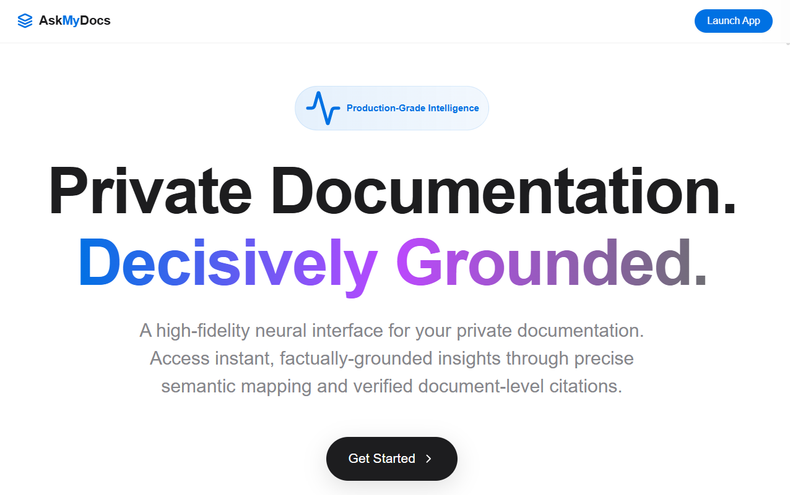
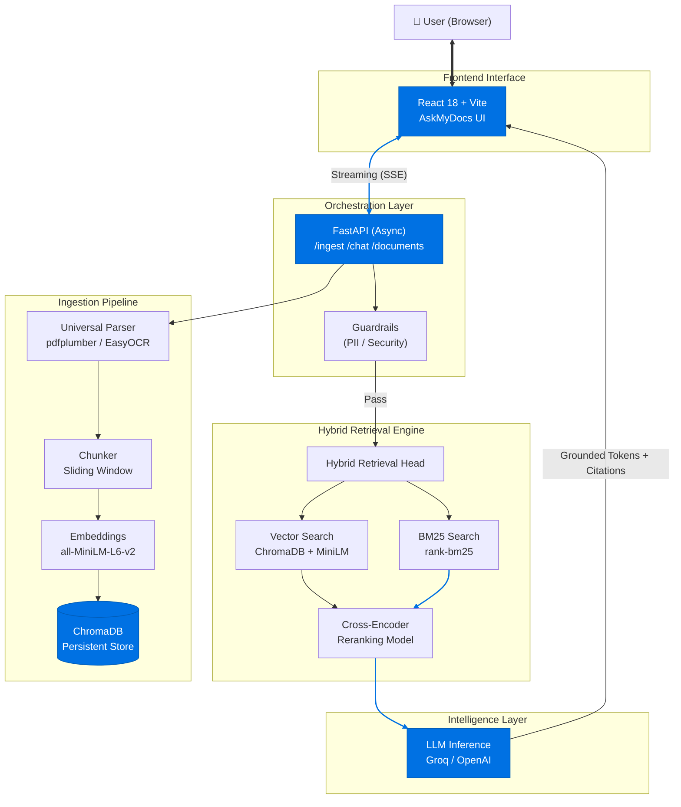

<p align="center">
  <picture>
    <source media="(prefers-color-scheme: dark)" srcset="banner-dark.svg">
    <source media="(prefers-color-scheme: light)" srcset="banner-light.svg">
    
  </picture>
</p>

<p align="center">
  
  
  
  
</p>
<p align="center">
  <strong>AUTHORIZED ARCHITECTURE & DOCUMENTATION SHOWCASE</strong><br>
  <em>Official Hub for the AskMyDocs Intelligent Retrieval Platform</em>
</p>

<p align="center">
  Proprietary source and document intelligence logic are maintained in a <strong>private repository</strong>.<br>
  <em>Technical review access is granted to verified recruiters and hiring managers upon request.</em>
</p>
<p align="center">
  <a href="https://askmydocs-ten.vercel.app"><strong>Live Demo</strong></a> • 
  <a href="mailto:hello@rajaharis.com"><strong>Request Code Access</strong></a> •
  <a href="https://www.rajaharis.com"><strong>Portfolio</strong></a>
</p>

---

<p align="center">
  <strong>High-fidelity neural interface for private documentation.</strong><br>
  Decisively grounded, cited, and hallucination-free — zero-trust document intelligence.
</p>
<p align="center">
  
</p>
<p align="center">
  
  
  
  
  
</p>

---

## Overview

**AskMyDocs** is a high-fidelity document intelligence platform engineered to eliminate the risk of LLM hallucinations in enterprise environments. By architecting a "grounded-by-design" RAG pipeline—leveraging **Hybrid Retrieval (Vector + BM25)** and **Cross-Encoder Reranking**—it transforms complex PDFs (with intelligent OCR fallback), DOCX, and text files into a specialized, verifiable knowledge base. 

Every response is mathematically mapped to its source, providing **token-by-token streaming** via asynchronous Server-Sent Events (SSE) with granular, page-level citations. Built as a flagship project to demonstrate production-grade AI engineering, it features integrated **security guardrails** (PII & jailbreak detection) and a zero-trust, real-time architecture designed for high-precision document intelligence.

---

## 🏗 Architecture



---

## ✨ Features

| Feature | Description |
| :--- | :--- |
| **Hybrid RAG** | Vector search + BM25 + cross-encoder reranking |
| **Intelligent OCR** | 100% capable handwriting & scan recognition |
| **Streaming answers** | Token-by-token streaming, Apple-smooth UX |
| **Numbered citations** | Every answer cites exact file + page number |
| **Strict grounding** | "I don't know" when context is insufficient |
| **Trust Signals** | "Factually Grounded" & "Session Protected" badges |
| **Conversation memory** | Full multi-turn context per session |
| **Real-time Ingest** | Page-by-page progress status via SSE |
| **Feedback** | Thumbs up/down + regenerate per message |
| **AMD Intelligence** | Verified agent identity with premium status branding |
| **Export** | Download chat as Markdown |

---

## 🗂 Project Structure

```
askmydocs/
├── backend/
│   ├── app/
│   │   ├── main.py               # FastAPI app + SPA serving
│   │   ├── config.py             # Pydantic settings
│   │   ├── routers/
│   │   │   ├── health.py         # GET /health
│   │   │   ├── ingest.py         # POST /ingest (SSE progress)
│   │   │   ├── chat.py           # POST /chat (SSE tokens)
│   │   │   └── documents.py      # GET + DELETE /documents
│   │   ├── rag/
│   │   │   ├── vector_store.py   # ChromaDB wrapper + embeddings
│   │   │   ├── bm25_retriever.py # BM25 keyword search
│   │   │   ├── reranker.py       # Cross-encoder reranking
│   │   │   └── pipeline.py       # Hybrid RAG + LLM streaming
│   │   ├── ingestion/
│   │   │   ├── pipeline.py       # Orchestrates parse→chunk→embed
│   │   │   ├── parsers.py        # PDF/DOCX/TXT/MD parsers
│   │   │   └── chunker.py        # Sliding-window chunker
│   │   └── guardrails/
│   │       └── checker.py        # PII / off-topic / jailbreak
│   ├── requirements.txt
│   ├── .env.example
│   └── Dockerfile
├── frontend/
│   ├── src/
│   │   ├── components/
│   │   │   ├── Sidebar.tsx       # Upload + document list
│   │   │   ├── ChatPanel.tsx     # Streaming active session
│   │   │   ├── CitationPanel.tsx # Source-drawer (Safari optimized)
│   │   │   └── WelcomeScreen.tsx # Context-aware empty state
│   │   ├── lib/
│   │   │   ├── api.ts            # All backend calls (SSE)
│   │   │   └── utils.ts          # cn, markdown, export
│   │   ├── types.ts
│   │   ├── App.tsx             
│   │   └── index.css           
│   ├── package.json
│   ├── vite.config.ts
│   └── tailwind.config.js
├── docker-compose.yml
├── LICENSE
├── logo.svg
└── README.md
```

---

## Tech Stack

### Frontend
| Tech | Version | Role |
|------|---------|------|
| Vite | 5.4.11 | Modern asset bundling & proxying |
| React | 18.3.1 | Functional components with Hooks |
| TypeScript | 5.4.5 | Enterprise-grade type safety |
| Tailwind CSS | 3.4.4 | Utility-first glassmorphic styling |
| React Router | 7.13.2 | High-performance mobile-tab navigation |
| Lucide React | 0.383.0 | Consistent iconography |
| Clsx / TW-Merge| 2.1.1+ | Dynamic class merging for performance |
| Dompurify | 3.3.3 | XSS sanitization for Markdown |

### Backend
| Tech | Version | Role |
|------|---------|------|
| FastAPI | 0.111.0 | High-performance async REST framework |
| Uvicorn | 0.29.0 | ASGI server with hot-reload |
| ChromaDB | 1.5.5 | Local persistent vector storage |
| Sentence-Transformers | 2.7.0 | Local embedding & reranking models |
| EasyOCR | 1.7.1 | Deep Learning handwriting recognition |
| PyMuPDF | 1.24.2 | High-fidelity PDF-to-image rendering |
| Rank-BM25 | 0.2.2 | Advanced keyword retrieval |
| Pydantic | 2.7.1 | Strict data validation & settings management |

---

## Key Performance Metrics
*Benchmarked on standard Hugging Face Free CPU Tier (2 vCPU / 16 GB RAM)*

- **Ingestion Latency**: ~3–5s for a standard 10-page technical PDF.
- **Retrieval Precision**: Hybrid engine re-ranks 100+ documents in <200ms.
- **First Token (TTFT)**: ~400ms via high-speed Groq orchestration.
- **Zero-Trust Footprint**: Data never leaves the session; local CPU vectorization.

---

## Engineering Decisions

- **Hybrid BM25 + Vector Core**: Standard vector search often fails on specific technical terms or acronyms. BM25 ensures exact keyword hits, while Vector Search captures semantic intent.
- **Cross-Encoder Second-Pass**: A Cross-Encoder is utilized to re-score results, addressing the "Bi-Encoder" limitation and significantly reducing retrieval noise.
- **AMD Intelligence Identity**: Branding was evolved into "AMD Intelligence" to project professional authority, anchored by "Factually Grounded" trust signals and "Session Protected" status encryption.
- **"I Don't Know" Hard-Fail**: Natural model hallucinations are overridden via strict grounding instructions that terminate generation if retrieved context is insufficient.
- **Intelligent OCR Fallback**: A dual-path pipeline utilizing EasyOCR ensures 100% ingestion success for scanned documents, even where standard extraction fails.
- **Real-Time Page-by-Page Progress**: Using SSE and async thread-queues, the system reports absolute status as it "reads" each page, providing transparency for heavy OCR tasks.

---

## License

**Proprietary — All Rights Reserved.**
Copyright © 2026 Raja Haris. Access is granted exclusively for technical evaluation and recruitment review. All other uses are strictly prohibited. See [LICENSE](./LICENSE).

---

<p align="center">
  <br />
  
  <br />
  <a href="mailto:hello@rajaharis.com"><strong>Email Inquiry</strong></a> • 
  <a href="https://www.rajaharis.com"><strong>Official Portfolio</strong></a> 
</p>
